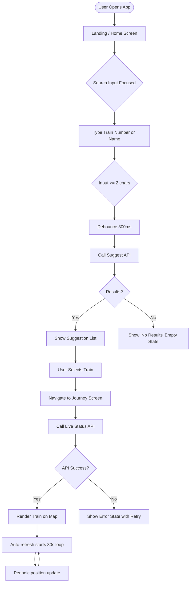
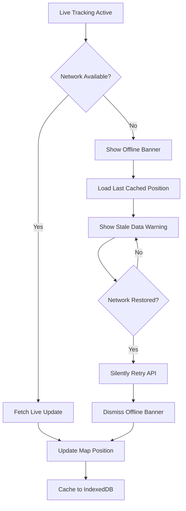
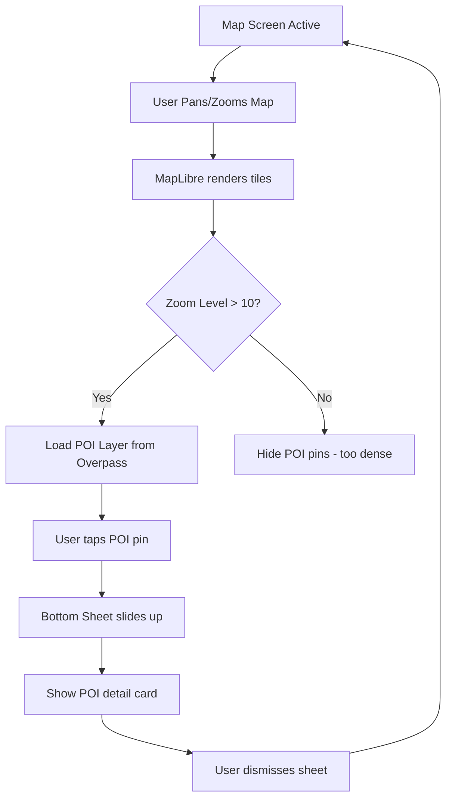
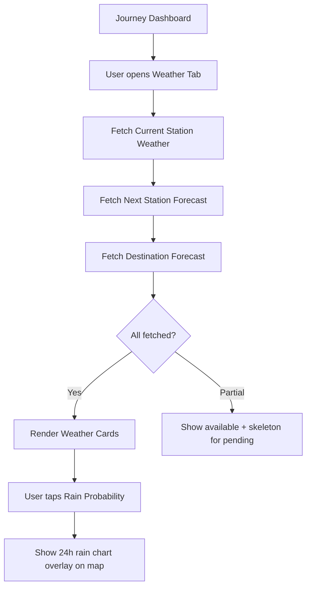
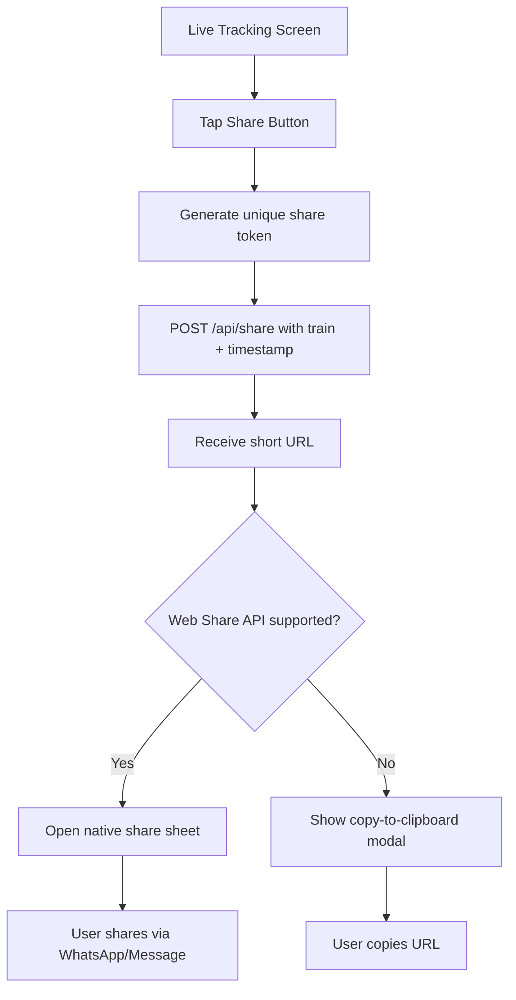
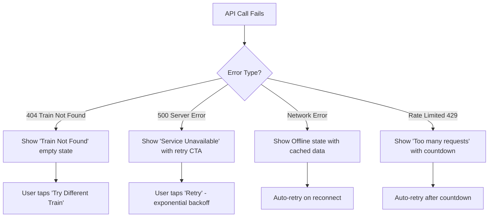
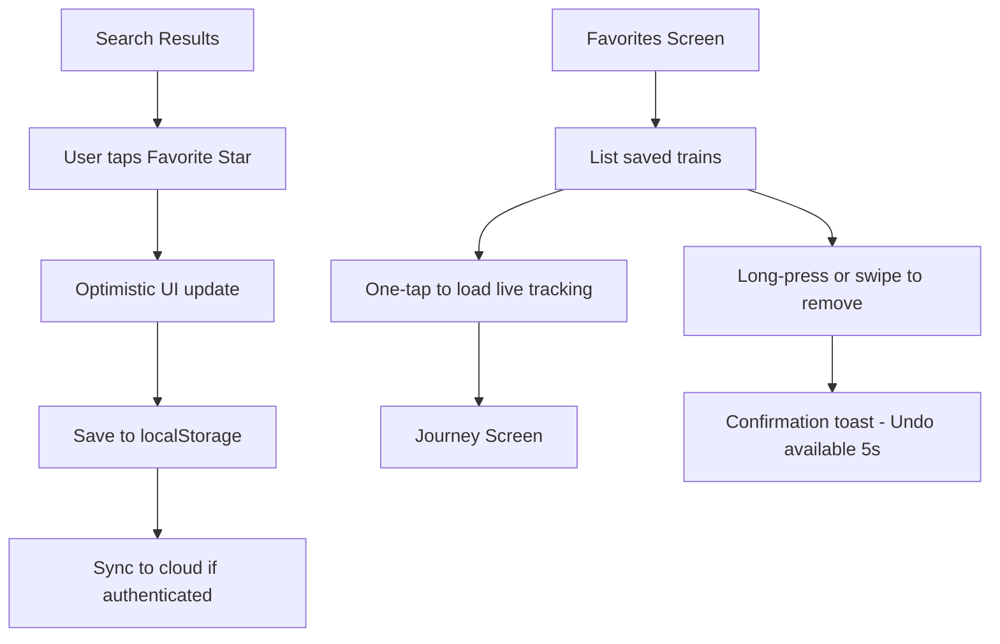
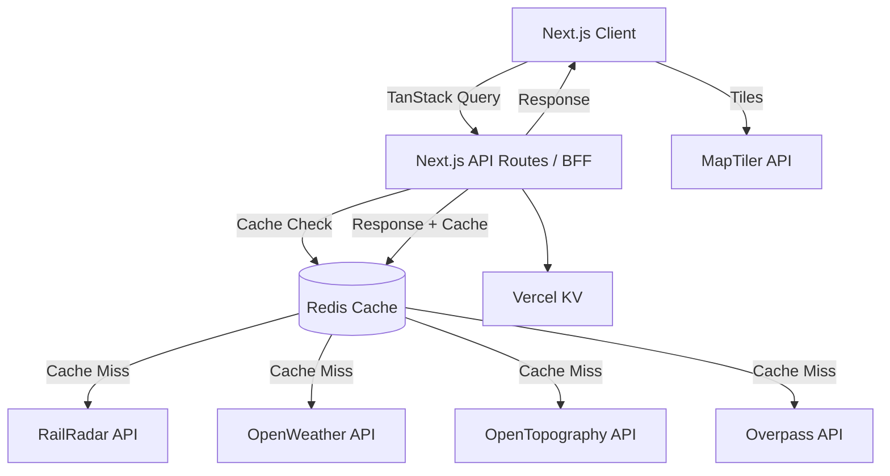
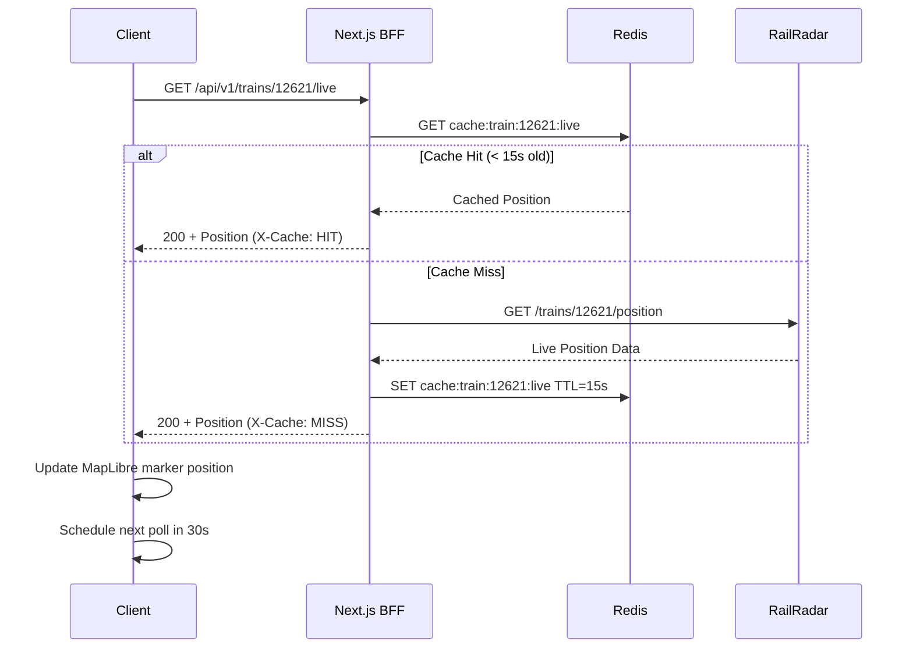

# Bharat Rail — Enterprise Product Requirements Document (PRD)

**Version:** 1.0.0  
**Date:** July 31, 2026  
**Status:** Ready for Engineering Review  
**Classification:** Internal — Confidential  
**Authors:** Product Organization (Staff PM · Principal Architect · Senior UX · Frontend Architect · Backend Architect · DevOps · Data Architect · QA Lead · Accessibility Specialist · Performance Engineer)

---

> _"We didn't just build a train tracker. We built the most beautiful way to experience India's railways."_

---

## Table of Contents

1. Executive Summary  
2. Product Scope  
3. User Personas  
4. User Stories  
5. Complete User Flows  
6. Functional Requirements  
7. Information Architecture  
8. UI / UX Specification  
9. design.md — Visual Language Specification  
10. Technical Architecture  
11. API Design  
12. Data Models  
13. Component Inventory  
14. State Management  
15. Performance Strategy  
16. Security  
17. Accessibility  
18. Observability  
19. Testing Strategy  
20. Deployment  
21. Development Roadmap (2-Phase)  
22. Appendix  

---

# 1. Executive Summary

## Product Vision

Bharat Rail is the definitive digital companion for rail travel in India — an application that transforms what has historically been a fragmented, stressful experience into something joyful, intelligent, and immersive. Where competitors present raw data in utilitarian tables, Bharat Rail presents your journey as a living, breathing experience rendered on a beautiful interactive map.

## Mission

To make every train journey in India feel like a first-class experience through world-class design, real-time intelligence, and contextual travel awareness — regardless of whether you're riding Rajdhani Express or a regional passenger train.

## Product Philosophy

Bharat Rail is built on four philosophical pillars:

| Pillar | Principle |
|--------|-----------|
| **Clarity** | Every piece of information should be immediately understandable without reading instructions |
| **Delight** | Every interaction should feel noticeably better than the alternative |
| **Intelligence** | The app should know what you need before you ask |
| **Honesty** | Never hide bad news — present delays, cancellations, and issues with empathy and context |

Inspirations: Apple Maps (spatial intelligence + map polish), Flighty (real-time confidence + proactive updates), Linear (precision engineering UI), Arc Browser (opinionated beauty), Notion (information hierarchy).

## Core Value Proposition

> **Bharat Rail is the only train companion that gives you a cinema-quality live map, AI-level journey intelligence, and contextual weather and geography — all in a single breathtakingly beautiful interface.**

## Key Differentiators

1. **Live animated train marker** on a full-screen, photorealistic India map (MapTiler + MapLibre GL)  
2. **Journey Health Score** — a proprietary composite metric combining delay, speed consistency, and ETA accuracy  
3. **Along-Route Intelligence** — geo-fenced POI discovery (rivers, tunnels, ghats, mountains, bridges, tourist spots) using Overpass API  
4. **Elevation Profile** powered by OpenTopography — see the Himalayas and Western Ghats as you cross them  
5. **Weather-aware ETA** incorporating OpenWeather forecasts along the entire route  
6. **Apple Maps–grade UI polish** with glass morphism, smooth spring animations, and zero visual noise  

## Problem Statement

India's 23 million daily rail passengers have access to three primary sources of train information: NTES (National Train Enquiry System), RailYatri, and Where Is My Train. All three suffer from:

- **Outdated UX** — tabular data with no spatial context  
- **Poor reliability perception** — raw delay numbers with no context or trend  
- **Zero environmental intelligence** — no weather, geography, or POI awareness  
- **No journey narrative** — passengers feel passive, not engaged  
- **No performance design** — slow loads, janky scrolling, intrusive ads  

## Opportunity

India's railway system is the 4th largest in the world. With 67,000+ km of routes and 13,000+ daily trains, even a 1% market capture of the digitally-active traveler segment represents tens of millions of monthly active users. The premium tier, PWA offline capability, and B2B travel-intelligence API represent distinct revenue streams.

## Business Goals

| Goal | Target | Timeline |
|------|--------|----------|
| Monthly Active Users | 500,000 | Month 6 |
| Monthly Active Users | 2,000,000 | Month 12 |
| PWA Install Rate | 30% of recurring users | Month 6 |
| Average Session Duration | > 8 minutes | Month 3 |
| D7 Retention | > 40% | Month 6 |
| Crash-Free Sessions | > 99.5% | At Launch |
| App Store Rating (if wrapped) | > 4.7 | Month 3 |

## Success Metrics & KPIs

| Metric | Definition | Target |
|--------|-----------|--------|
| **North Star** | Weekly Active Journeys Tracked | 1M by Month 6 |
| TTFMP (Time to First Meaningful Paint) | Map loads within | < 2.5s |
| Search-to-Track | Time from search to live train visible on map | < 4s |
| ETA Accuracy | Predicted vs. Actual arrival within ±5 min | > 85% |
| Refresh Cycle | Auto-refresh without user-perceived jank | < 30s interval |
| Journey Completion Awareness | % users who view analytics tab | > 60% |
| Share Feature Adoption | % journeys with share link generated | > 20% |
| Accessibility Score | Lighthouse Accessibility Score | > 95 |

## North Star Metric

> **Weekly Active Journeys Tracked** — the number of unique train journeys actively monitored by Bharat Rail users in a 7-day window. This metric directly reflects product-market fit because it only counts engaged, return users who trust the platform enough to use it for a real trip.

---

# 2. Product Scope

## In Scope (Phase 1 + Phase 2)

- Live train search (number, name, auto-suggest)
- Real-time train position on interactive India map
- Journey status (current, previous, next station, delay, ETA)
- Full-screen immersive map with animated train marker
- Route visualization (completed/remaining highlight + glow)
- Journey analytics dashboard
- Weather integration (current, next station, destination)
- Along-route POI discovery
- Elevation profile
- Favorites and recent searches (localStorage + cloud sync)
- Shareable journey link (unique URL with embedded train state)
- Progressive Web App (offline capability)
- Responsive web (mobile-first)
- White theme (primary); dark mode (Phase 2)

## Out of Scope

- Ticket booking or PNR-based tracking (separate product)
- Seat availability or fare lookup
- Native iOS / Android apps (PWA wrapping considered Phase 3)
- Station navigation / inside-station maps
- Train food ordering integration
- Real-time seat occupancy
- User accounts (Phase 1); optional auth in Phase 2

## Future Scope (Phase 3+)

- AI journey assistant (GPT-4 powered Q&A about your journey)
- Crowdsourced delay reports
- B2B API product for travel agencies and corporate travel
- Journey photo album (geo-tagged)
- Social sharing stories
- Apple Watch / wearable companion
- Voice commands

## Technical Constraints

| Constraint | Detail |
|-----------|--------|
| RailRadar API rate limit | Must be respected; no polling faster than allowed interval |
| MapTiler tile quota | Tile budget managed per session; adaptive loading required |
| OpenWeather call budget | Max 1,000 free calls/day; cache aggressively |
| OpenTopography | Elevation data is static per route; cache indefinitely |
| Browser localStorage | 5–10MB limit; LRU eviction required |
| PWA offline | Only last-viewed journey cached; not full app |

## Business Constraints

- No paid third-party APIs in Phase 1 that require > ₹50,000/month
- All external API keys must be server-side only (no client-side exposure)
- GDPR and Indian IT Act compliance from day one
- Mobile-first; must score > 90 on Lighthouse Mobile

## Assumptions

1. RailRadar API provides sufficiently reliable live train position data
2. MapTiler free tier covers early-stage traffic; upgrade triggers at 50k DAU
3. Users have modern browsers (Chrome 100+, Safari 15+, Firefox 100+)
4. 4G connectivity is baseline; 2G fallback degrades gracefully
5. Indian user base; initial language: English only

## Risks

| Risk | Likelihood | Impact | Mitigation |
|------|-----------|--------|-----------|
| RailRadar API downtime | Medium | High | Fallback to cached data + user-visible status |
| Map tile load on slow networks | High | Medium | Progressive loading, low-res fallback tiles |
| Inaccurate train position data | Medium | High | Display confidence score; show last-updated timestamp |
| Browser PWA limitations on iOS | High | Medium | Test on Safari; document known limitations |
| OpenWeather quota exceeded | Low | Medium | Redis cache with 30-min TTL; alert at 80% quota |

---

# 3. User Personas

## Persona 1: Daily Commuter — Arjun Sharma

| Attribute | Detail |
|-----------|--------|
| Age | 28 |
| Occupation | Software Engineer, Bengaluru |
| Route | KSR Bengaluru → Mysuru (daily) |
| Device | iPhone 14, 5G |
| Technical Skill | High |
| Usage Frequency | Daily, 2× per day |

**Goals:** Know exactly when the train will depart; avoid wasting time at the platform; share ETA with family.

**Frustrations:** NTES shows outdated timestamps; no way to know if the delay is getting worse or better; UI is unusable on mobile.

**Behavior:** Opens app 20 minutes before departure, checks live position, shares link with wife, follows journey for first 10 minutes, reopens at destination.

**Accessibility Needs:** None currently; uses app in sunlight (high contrast needed).

---

## Persona 2: Long Distance Traveler — Priya Nair

| Attribute | Detail |
|-----------|--------|
| Age | 34 |
| Occupation | Consultant, Mumbai |
| Route | Mumbai CSMT → Delhi Hazrat Nizamuddin (16+ hours) |
| Device | Samsung Galaxy S22, 4G |
| Technical Skill | Medium |
| Usage Frequency | 2-3× per month |

**Goals:** Know when to wake up; discover what's outside the window; track the journey as an experience.

**Frustrations:** No sense of where she is geographically; misses interesting sights; wakes up for wrong stations.

**Behavior:** Keeps app open on lock screen during journey; checks weather at destination; loves the map.

**Accessibility Needs:** Prefers larger text; needs high contrast in dark train cabins.

---

## Persona 3: Family Traveler — Rajesh Mehta

| Attribute | Detail |
|-----------|--------|
| Age | 45 |
| Occupation | Business Owner, Ahmedabad |
| Route | Ahmedabad → Goa (vacation) |
| Device | Xiaomi Redmi Note 12, 4G |
| Technical Skill | Low-Medium |
| Usage Frequency | Monthly |

**Goals:** Keep family informed; know exact ETA for hotel pickup; show kids where they are on the map.

**Frustrations:** Complex UIs; data in tabular form is confusing; multiple apps needed.

**Behavior:** Shares journey link with hotel driver and in-laws; uses map as entertainment for kids; checks weather at Goa.

**Accessibility Needs:** Larger touch targets; simple navigation; no jargon.

---

## Persona 4: Rail Enthusiast — Vikram Iyer

| Attribute | Detail |
|-----------|--------|
| Age | 22 |
| Occupation | Engineering Student, Chennai |
| Route | Varied — rides many trains |
| Device | OnePlus 11, WiFi + 5G |
| Technical Skill | Very High |
| Usage Frequency | Weekly |

**Goals:** Analyze journey data; see elevation profiles; discover railway trivia; share journey analytics.

**Frustrations:** No analytics; no historical data; apps treat all trains the same.

**Behavior:** Studies the analytics dashboard; saves favorite trains; shares journey screenshots.

**Accessibility Needs:** Reduced motion toggle (mild vestibular sensitivity).

---

## Persona 5: Tourist — Sarah Chen

| Attribute | Detail |
|-----------|--------|
| Age | 27 |
| Occupation | Travel Blogger, USA |
| Route | Delhi → Jaipur; Kolkata → Darjeeling |
| Device | iPhone 15 Pro |
| Technical Skill | High |
| Usage Frequency | Trip-based (5-10× per year India visits) |

**Goals:** Discover interesting things along the route; photograph at right moments; understand geography.

**Frustrations:** Indian railway apps assume local knowledge; no English-friendly UX.

**Behavior:** Uses POI layer extensively; looks at elevation profile through mountain routes; generates share links for blog.

**Accessibility Needs:** None.

---

## Persona 6: Student — Kavya Reddy

| Attribute | Detail |
|-----------|--------|
| Age | 19 |
| Occupation | College Student, Hyderabad |
| Route | Hyderabad → Vijayawada |
| Device | Budget Android, 4G |
| Technical Skill | Medium |
| Usage Frequency | Weekly (home visits) |

**Goals:** Know exactly when to get off; set informal alarm based on next station ETA; low data usage.

**Frustrations:** Data-heavy apps; confusing UI; app crashes on low-end devices.

**Behavior:** Searches train by name; checks next station ETA; installs as PWA to save data.

**Accessibility Needs:** Performance on low-end devices; offline capability.

---

# 4. User Stories

## Epic 1: Live Train Tracking

### Story 1.1 — Search Train by Number
> As a user, I want to search for a train by its 5-digit number so that I can quickly access its live status.

**Acceptance Criteria:**
- Input accepts 5-digit numeric strings
- Validates format before API call
- Returns results within 2 seconds
- Displays train name, origin, destination, and current status in result card
- Invalid numbers show inline error without navigating away

**Priority:** P0  
**Dependencies:** RailRadar Search API  
**Definition of Done:** Unit test coverage > 90%; Lighthouse score > 90 on result screen; accessibility audit passes

---

### Story 1.2 — Auto Suggestions
> As a user, I want real-time suggestions as I type so that I don't need to know the exact train number or spelling.

**Acceptance Criteria:**
- Suggestions appear after 2+ characters
- Debounced at 300ms
- Shows up to 7 results
- Each suggestion shows train number, name, route summary
- Keyboard navigable (↑↓ + Enter)
- Dismiss on Escape

**Priority:** P0  
**Dependencies:** RailRadar Suggest API

---

### Story 1.3 — Live Train Position
> As a user, I want to see my train's exact position on the map so that I have a real sense of where I am geographically.

**Acceptance Criteria:**
- Animated marker (train icon) moves smoothly between GPS coordinates
- Position updates within configured auto-refresh interval (≤ 30 seconds)
- "Last Updated" timestamp visible at all times
- Offline: shows last known position with "stale data" badge
- Low accuracy: shows accuracy radius circle around marker

**Priority:** P0  
**Dependencies:** RailRadar Live API, MapLibre GL

---

### Story 1.4 — Share Journey Link
> As a user, I want to share a link to my live journey so that friends and family can follow along.

**Acceptance Criteria:**
- Generated URL is unique and human-readable (e.g., `bharatrail.in/journey/12621-live`)
- Link opens to read-only view showing live train position
- No login required to view shared link
- Includes native share sheet on mobile (Web Share API)
- Link expires after train arrival + 2 hours

**Priority:** P1

---

## Epic 2: Immersive Journey Map

### Story 2.1 — Full-Screen Interactive Map
> As a user, I want a full-screen India map so that I can experience the journey spatially and emotionally.

**Acceptance Criteria:**
- Map occupies 100% viewport; UI overlays use floating cards
- Renders within 3 seconds on 4G
- Supports pinch-to-zoom, pan, rotate, and pitch (3D tilt)
- Graceful degradation to 2D on low-memory devices

**Priority:** P0

---

### Story 2.2 — Route Glow Animation
> As a user, I want the completed route to glow and the remaining route to appear distinct so that I understand journey progress visually.

**Acceptance Criteria:**
- Completed route: luminous gold/amber glow, animated pulse
- Remaining route: muted blue-grey dashed line
- Current position: animated pulsing ring
- Smooth transition as train moves (no flicker)
- Animation respects `prefers-reduced-motion`

**Priority:** P1

---

## Epic 3: Journey Analytics

### Story 3.1 — Journey Health Score
> As a user, I want a single score that tells me how my journey is performing so that I can immediately understand its health.

**Acceptance Criteria:**
- Score: 0–100, color-coded (green/yellow/red)
- Formula: weighted composite of on-time performance (50%), speed consistency (30%), ETA accuracy (20%)
- Tooltip explains breakdown
- Animates from 0 to score on first view
- Updates every refresh cycle

**Priority:** P1

---

### Story 3.2 — Elevation Profile
> As a user, I want to see the elevation profile of my route so that I can appreciate the terrain I'm crossing.

**Acceptance Criteria:**
- Line chart showing elevation (metres) vs. distance (km)
- Current train position highlighted on chart
- Highest point labeled
- Data sourced from OpenTopography API
- Cached per route (elevation doesn't change)
- Graceful fallback if OpenTopography unavailable

**Priority:** P2

---

## Epic 4: Smart Travel Companion

### Story 4.1 — Current Station Weather
> As a user, I want to see the weather at my current station so that I know what to expect when I step off.

**Acceptance Criteria:**
- Shows: temperature, conditions icon, wind speed, humidity
- Data from OpenWeather Current API
- Refreshes every 30 minutes
- Shows "feels like" temperature
- Accessible: weather described in aria-label, not just icon

**Priority:** P1

---

### Story 4.2 — Along-Route POI Discovery
> As a user, I want to discover interesting things along my route (bridges, rivers, mountains) so that my journey feels explorative.

**Acceptance Criteria:**
- POI categories: rivers, lakes, mountains/ghats, bridges, tunnels, tourist attractions, cities
- Data from Overpass API, filtered to 50km corridor around route
- Appears as subtle pins on map
- Tap/click on pin shows POI card (name, type, distance from train)
- POI layer toggleable

**Priority:** P2

---

# 5. Complete User Flows

## Flow 1: Train Search to Live Tracking



---

## Flow 2: Journey Tracking with Offline Recovery



---

## Flow 3: Map Navigation & POI Exploration



---

## Flow 4: Weather Exploration



---

## Flow 5: Share Journey



---

## Flow 6: Error Recovery



---

## Flow 7: Favorites Management



---

# 6. Functional Requirements

## Screen: Search Screen

**Purpose:** Primary entry point. Enables train discovery by number, name, or selection from recents/favorites.

**Inputs:**
- Text input (train number or name), min 2 chars
- Voice input (Web Speech API, progressive enhancement)

**Outputs:**
- Suggestion list (max 7 items)
- Recent search history (max 10)
- Favorites rail (horizontal scroll, max 20)

**Validation Rules:**
- Numbers: 1–5 digits only
- Names: alpha + space, min 2 chars, max 60 chars
- Sanitize: strip HTML, trim whitespace
- XSS prevention: no `innerHTML` assignment

**Loading State:** Skeleton shimmer over 3 suggestion cards after 300ms debounce

**Error State:** Inline message "Couldn't load suggestions. Check connection." with icon

**Empty State:** Illustrated empty state "Search for any Indian train" with example train numbers

**Edge Cases:**
- User pastes URL containing train number → auto-extract and pre-fill
- User searches while offline → show cached recents only
- API returns duplicate entries → deduplicate by train number client-side

**Analytics Events:**
- `search_initiated` (query, input_method)
- `suggestion_selected` (train_number, position_in_list)
- `search_cleared`
- `recent_search_tapped`

---

## Screen: Live Journey Tracking

**Purpose:** Core experience. Shows train on map with all real-time data overlays.

**Inputs:** Train number (from search or URL param)

**Outputs:**
- Animated map with train marker
- Station info cards (previous, current, next)
- Delay badge
- ETA panel
- Journey progress bar
- Auto-refresh indicator
- Share button

**Validation Rules:**
- ETA must never show negative values; show "Arriving" if < 2 minutes
- Delay shown as "+N min" (positive only); early arrival shown as "On Time"
- Distance values: clamp to 0, round to 1 decimal

**Loading State:**
- Map loads first (skeleton tiles fade in)
- Train marker placed as soon as coordinates received
- Info cards load independently (staggered fade-in)

**Error State:**
- API fail: floating error card "Live data unavailable" with last-update timestamp
- Train completed journey: "Journey Complete" celebration screen with analytics summary

**Empty State:** If train not yet departed — "Journey starts at [time], come back then" with countdown

**Edge Cases:**
- Train diverted (different route): flag route as "amended" and re-fetch route geometry
- Train number format changed mid-journey: follow redirects from RailRadar
- GPS data missing for segment: interpolate position based on scheduled time
- Train at terminal: show "Arrived" state, stop auto-refresh

**Telemetry:**
- `journey_view_started` (train_number, source)
- `map_camera_follow_toggled`
- `refresh_triggered` (manual vs. auto)
- `share_tapped`
- `journey_view_duration`

---

## Screen: Journey Analytics Dashboard

**Purpose:** Deep dive into journey performance metrics for enthusiast users.

**Inputs:** Active journey context

**Outputs:**
- Journey Health Score (animated counter)
- Delay trend chart (15-minute buckets)
- Speed chart (km/h over time)
- Elevation profile chart
- Station arrival timeline
- Distance analytics (covered, remaining)
- Route summary card

**Validation Rules:**
- Speed: if > 200 km/h, flag as anomaly and exclude from average
- Elevation: filter out -9999 (OpenTopography no-data value)
- Arrival times: sort ascending; flag out-of-order as data anomaly

**Loading State:** Progressive chart loading; axis renders first, then data animates in

**Error State:** Per-card error treatment (one chart failing doesn't break others)

---

## Screen: Weather Companion

**Purpose:** Contextual weather at current station, next station, destination, and rain overlay on route.

**Inputs:** Station coordinates (lat/lon) from journey context

**Outputs:**
- Current station weather card
- Next station forecast card
- Destination forecast card
- Rain probability bar chart (next 12 hours)
- Temperature trend mini-chart

**Error State:** "Weather data unavailable" per card; does not block journey view

---

# 7. Information Architecture

## Application Sitemap

```
Bharat Rail
├── / (Home / Search)
│   ├── /search?q={query} (Search Results)
│   └── /train/{number} (Auto-redirect to Live)
├── /journey/{trainNumber}
│   ├── /journey/{trainNumber}/map (Default tab — Live Map)
│   ├── /journey/{trainNumber}/analytics
│   ├── /journey/{trainNumber}/weather
│   └── /journey/{trainNumber}/companion (POI along route)
├── /favorites
├── /recent
├── /share/{token} (Read-only shared journey view)
├── /settings
├── /about
├── /404
└── /offline
```

## Navigation Hierarchy

**Primary Navigation:** Bottom tab bar (mobile) / Left sidebar (desktop)

| Tab | Icon | Route |
|-----|------|-------|
| Search | 🔍 | `/` |
| Live Map | 🗺️ | Active journey |
| Analytics | 📊 | Active journey |
| Weather | 🌤️ | Active journey |
| Favorites | ⭐ | `/favorites` |

**Secondary Navigation:** Within Journey screen — horizontal tab pills (Map · Analytics · Weather · Companion)

## Route Structure

```
/                           → SearchScreen
/journey/:trainId           → JourneyScreen (tabs: map, analytics, weather, companion)
/favorites                  → FavoritesScreen
/recent                     → RecentSearchesScreen
/share/:token               → SharedJourneyScreen (read-only)
/settings                   → SettingsScreen
/404                        → NotFoundScreen
```

## Responsive Layout Strategy

| Breakpoint | Layout | Navigation |
|-----------|--------|-----------|
| < 640px (mobile) | Single column; full-screen map; bottom tabs | Bottom tab bar |
| 640–1024px (tablet) | Split: map left 60% / info panel right 40% | Top nav + tabs |
| > 1024px (desktop) | Three-column: sidebar / map / analytics panel | Left sidebar |

---

# 8. Complete UI / UX Specification

## Global Design Tokens

```
Background:    #FFFFFF (primary), #F7F7F5 (surface), #FAFAF9 (muted)
Text Primary:  #0A0A0A
Text Secondary:#6B6B6B
Text Tertiary: #A0A0A0
Accent Blue:   #0066FF
Accent Amber:  #FF9500
Accent Green:  #34C759
Accent Red:    #FF3B30
Border:        #E8E8E6
Shadow:        rgba(0,0,0,0.06)
Glass:         rgba(255,255,255,0.85) + backdrop-filter: blur(20px)
```

---

## Landing Page

**Layout:** Centered hero with search bar; floating glass card

**Hero Section:**
- Full-viewport India map (interactive, non-focusable background layer)
- Centered overlay: wordmark "Bharat Rail" in SF Pro Display–like font
- Tagline: "Track every journey. Experience India."
- Search input: rounded pill (border-radius: 100px), 56px height, auto-focus on load
- Recent searches: horizontal scroll below search bar, max 5 visible
- Favorites: horizontal scroll, badge shows train number + delay status

**Spacing:** 24px horizontal padding (mobile), 48px (tablet), 80px (desktop)

**Animations:**
- Map gently pans on load (Ken Burns effect, very slow, 30s loop)
- Search bar: subtle entrance animation (slide-up + fade, 0.4s ease-out)
- Suggestion list: staggered card entrance (50ms delay between items)

**Empty State (no recents):** Illustration of an Indian train on a mountain pass; CTA "Search any Indian train"

---

## Search Screen

**Input Field:**
- Height: 56px
- Border: 1.5px solid #E8E8E6 (focus: 1.5px solid #0066FF)
- Prefix icon: search (magnifier), 20px
- Suffix: clear (×) when text present; microphone icon when empty (voice search)
- Placeholder: "Train number or name..."

**Suggestion List:**
- Card height: 72px
- Left: Train number badge (monospace, blue pill background)
- Center: Train name (semibold, 15px) + route summary (12px, muted)
- Right: Status badge (green = on time, amber = delayed, red = significantly delayed)
- Divider: 1px #E8E8E6 between items
- Hover/focus: #F7F7F5 background
- Active: scale(0.98) + #F0F0EE

**Recent Searches Section:**
- Section header: "Recent" (12px uppercase, tracking 0.08em, muted)
- Same card layout as suggestions; additional "×" to remove
- Stored in localStorage; max 10 entries

---

## Live Tracking Screen

**Map Layer (Bottom):**
- Full viewport; z-index: 0
- MapLibre GL canvas
- White/light map style (MapTiler "Streets" or custom white style)

**UI Overlay (Top):**
- Top bar: glass card, 56px height
  - Left: back arrow + train number + name
  - Right: share icon + refresh indicator (animated dot when refreshing)
- Journey progress bar: full-width, 4px height, beneath top bar; amber fill = completed distance

**Train Position Card (bottom-anchored, mobile):**
- Height: auto (collapsible)
- Collapsed: shows Current Station + ETA to Next
- Expanded: full station list visible
- Drag handle at top (8px × 48px pill)

**Station Panel:**
- Previous Station: muted, small (greyed out)
- Current Station: prominent, 20px semibold, blue left border, weather widget
- Next Station: medium weight, with ETA countdown
- Stations further ahead: listed in scroll

**Delay Badge:**
- On time: green pill "On Time"
- ≤ 15 min late: amber pill "+8 min"
- > 15 min late: red pill "+45 min"
- Early: green pill "5 min early"

**Auto-refresh indicator:**
- Subtle animated dot (pulsing) in top bar during refresh
- "Updated just now" → "Updated 30s ago" → "Updated 1m ago"

---

## Analytics Screen

**Layout:** Scrollable cards; each card is independently loaded

**Journey Health Score Card:**
- Score: large animated counter (0 → score, 1.2s ease-out)
- Circular progress arc (Canvas or SVG)
- Color: green > 80, amber 50–80, red < 50
- Sub-metrics row: on-time %, avg speed, ETA accuracy

**Delay Trend Chart:**
- Line chart (Chart.js or Recharts)
- X-axis: time; Y-axis: delay minutes
- Zero line prominent; negative (early) shown in green zone
- Hover tooltip: exact delay at that time

**Speed Chart:**
- Area chart, amber gradient fill
- Annotations: "Slowest segment" and "Fastest segment" labeled

**Elevation Profile Chart:**
- Line chart with terrain-fill gradient (light blue → white)
- Current position: vertical red line
- Highest point: annotation pin
- X-axis: distance from origin (km)

**Timeline View:**
- Each station: horizontal timeline item
  - Station name (left)
  - Scheduled arrival (right)
  - Actual arrival (right, colored by delay)
  - Status icon (arrived ✓, current ◉, upcoming ○)

---

## Weather Screen

**Layout:** Vertical stack of weather cards

**Current Station Card:**
- Large temperature (48px, semibold)
- Condition icon (40px, animated for rain/clouds)
- Wind speed + direction arrow
- Humidity bar
- Feels like temperature
- 6-hour mini forecast

**Next Station Card:**
- 12-hour forecast strip (hourly icons + temp)

**Destination Card:**
- 24-hour forecast; daily high/low

**Rain Probability Card:**
- Bar chart (12 bars = 12 hours)
- Threshold line at 50%
- Bars: gradient blue fill

---

## Map Screen (Full-Screen Mode)

**Map Controls (floating, right side):**
- Zoom In (+)
- Zoom Out (−)
- Reset North (compass rose, rotates to show bearing)
- Camera Follow Toggle (train icon, active = blue)
- 3D Tilt Toggle (cube icon)
- POI Layer Toggle (pin icon)
- Full-screen toggle

**Controls:** Glass morphism buttons, 44px × 44px each, 8px border-radius, stacked vertically with 8px gap

**Route Rendering:**
- Completed: rgba(255, 149, 0, 0.9) + glow filter (blur 4px, amber)
- Remaining: rgba(150, 160, 180, 0.6) + dashed stroke
- Train marker: custom SVG train icon, 40px, drop-shadow, rotated to direction of travel
- Pulsing accuracy ring: rgba(0, 102, 255, 0.15), animates scale 1 → 1.8 → 1, 2s loop

---

## 404 / Error / Offline Screens

**404:**
- Illustration: train missing from tracks (custom SVG)
- Heading: "Train not found"
- Subtext: "This route seems to have gone off-track."
- CTA: "Search another train"

**Error:**
- Illustration: signal tower with broken connection
- Heading: "Something went wrong"
- Subtext: last error details (dev-readable)
- CTA: "Retry" (with exponential backoff visible as countdown)

**Offline:**
- Illustration: train in fog
- Heading: "You're offline"
- Subtext: "Showing last known journey status."
- Last-updated timestamp
- Auto-reconnect listener (no user action needed)

---

## Settings Screen

| Setting | Type | Default |
|---------|------|---------|
| Auto-refresh interval | Select (15s, 30s, 60s) | 30s |
| Distance unit | Toggle (km / miles) | km |
| Temperature unit | Toggle (°C / °F) | °C |
| Reduced motion | Toggle | System default |
| Clear recent searches | Button | — |
| Clear favorites | Button | — |
| Install PWA | Button (conditional) | — |
| App version | Text | — |

---

# 9. design.md — Visual Language Specification

## Design Philosophy

Bharat Rail's design language is called **"Clarity in Motion"** — a system built on three truths:

1. **Data should feel natural, not clinical** — numbers come alive through animation and color
2. **Whitespace is content** — negative space guides attention, reduces cognitive load
3. **Every transition is storytelling** — the journey metaphor extends to how screens move

The visual style draws from:
- Apple Maps: spatial grounding, cartographic elegance
- Linear: precision typography, systematic spacing
- Flighty: real-time confidence, bold status colors
- Indian design heritage: warm accent colors (saffron amber, deep rail blue)

---

## Color Palette

### Primary

| Name | Token | Hex | Usage |
|------|-------|-----|-------|
| Background | `--color-bg` | `#FFFFFF` | Page background |
| Surface | `--color-surface` | `#F7F7F5` | Card backgrounds |
| Surface Elevated | `--color-surface-elevated` | `#FFFFFF` | Modal / popup backgrounds |
| Border | `--color-border` | `#E8E8E6` | Dividers, input borders |
| Border Strong | `--color-border-strong` | `#D0D0CE` | Focused, emphasis borders |

### Text

| Name | Token | Hex | Usage |
|------|-------|-----|-------|
| Primary | `--color-text-primary` | `#0A0A0A` | Main content |
| Secondary | `--color-text-secondary` | `#6B6B6B` | Subtext, labels |
| Tertiary | `--color-text-tertiary` | `#A0A0A0` | Placeholders, hints |
| Inverse | `--color-text-inverse` | `#FFFFFF` | Text on dark backgrounds |

### Semantic

| Name | Token | Hex | Usage |
|------|-------|-----|-------|
| Accent | `--color-accent` | `#0066FF` | Primary actions, links, live indicator |
| Success | `--color-success` | `#34C759` | On time, health score high |
| Warning | `--color-warning` | `#FF9500` | Moderate delay, amber alert |
| Danger | `--color-danger` | `#FF3B30` | High delay, error, critical |
| Rail Saffron | `--color-rail-saffron` | `#FF6B00` | Completed route, brand accent |

### Map Palette

| Layer | Color |
|-------|-------|
| Completed route | `rgba(255, 107, 0, 0.9)` with amber glow |
| Remaining route | `rgba(150, 165, 200, 0.65)` dashed |
| Train marker shadow | `rgba(0, 102, 255, 0.25)` |
| Station pin | `#0066FF` fill, `#FFFFFF` stroke |
| POI pin | Category-specific icon tint on white badge |

---

## Typography Scale

Font Family: `Inter` (primary), `JetBrains Mono` (monospace — train numbers, timestamps)

| Scale | Token | Size | Weight | Line-Height | Usage |
|-------|-------|------|--------|-------------|-------|
| Display | `--type-display` | 40px | 700 | 1.1 | Hero headings |
| H1 | `--type-h1` | 32px | 700 | 1.2 | Page titles |
| H2 | `--type-h2` | 24px | 600 | 1.3 | Section headers |
| H3 | `--type-h3` | 20px | 600 | 1.35 | Card titles |
| Body Large | `--type-body-lg` | 17px | 400 | 1.5 | Primary content |
| Body | `--type-body` | 15px | 400 | 1.5 | Standard content |
| Body Small | `--type-body-sm` | 13px | 400 | 1.5 | Secondary content |
| Caption | `--type-caption` | 11px | 500 | 1.4 | Labels, badges |
| Mono | `--type-mono` | 14px | 500 | 1.4 | Numbers, codes |

Letter-spacing: tight at display size (−0.02em), normal at body (0), slightly tracked at caption (0.04em)

---

## Spacing Scale

```
2px   → --space-1   (micro: icon padding)
4px   → --space-2   (tight: between icon and label)
8px   → --space-3   (compact: intra-component)
12px  → --space-4   (standard: between related elements)
16px  → --space-5   (comfortable: section gaps mobile)
24px  → --space-6   (section gaps desktop)
32px  → --space-7   (major section breaks)
48px  → --space-8   (page-level breathing room)
64px  → --space-9   (hero sections)
96px  → --space-10  (full-page vertical rhythm)
```

---

## Grid System

| Breakpoint | Columns | Gutter | Margin |
|-----------|---------|--------|--------|
| Mobile < 640px | 4 | 16px | 16px |
| Tablet 640–1024px | 8 | 24px | 32px |
| Desktop > 1024px | 12 | 32px | 80px |

---

## Elevation & Shadows

| Level | Token | CSS |
|-------|-------|-----|
| None | `--elevation-0` | none |
| Subtle | `--elevation-1` | `0 1px 3px rgba(0,0,0,0.06)` |
| Card | `--elevation-2` | `0 2px 8px rgba(0,0,0,0.08)` |
| Raised | `--elevation-3` | `0 8px 24px rgba(0,0,0,0.10)` |
| Modal | `--elevation-4` | `0 16px 48px rgba(0,0,0,0.14)` |
| Floating | `--elevation-5` | `0 24px 64px rgba(0,0,0,0.18)` |

---

## Motion Principles

**Principle 1 — Physics-Based:** Use spring animations for interactive elements; avoid linear easing.

**Principle 2 — Purposeful:** Every animation must communicate state change, not merely decorate.

**Principle 3 — Respectful:** All animations must respect `prefers-reduced-motion: reduce`.

### Animation Durations

| Use | Duration | Easing |
|-----|----------|--------|
| Micro (hover, press) | 80ms | ease-out |
| Standard (card, modal) | 200ms | spring(1, 0.8, 0.3) |
| Page transition | 300ms | ease-in-out |
| Data entrance | 400ms | spring(1, 1, 0.4) |
| Long form (charts) | 800–1200ms | ease-out |
| Map camera | 600ms | MapLibre `easeInOutCubic` |

---

## Glass Effects

```css
.glass-card {
  background: rgba(255, 255, 255, 0.85);
  backdrop-filter: blur(20px) saturate(180%);
  -webkit-backdrop-filter: blur(20px) saturate(180%);
  border: 1px solid rgba(255, 255, 255, 0.6);
  box-shadow: 0 8px 32px rgba(0, 0, 0, 0.08);
}
```

---

## Component Tokens

### Buttons

| Variant | Background | Text | Border | Height | Radius |
|---------|-----------|------|--------|--------|--------|
| Primary | `#0066FF` | white | none | 48px | 12px |
| Secondary | `#F7F7F5` | `#0A0A0A` | `1px #E8E8E6` | 48px | 12px |
| Ghost | transparent | `#0066FF` | none | 48px | 12px |
| Danger | `#FF3B30` | white | none | 48px | 12px |
| Icon | `#F7F7F5` | icon color | none | 44px | 100% |

### Cards

| Type | Radius | Padding | Shadow |
|------|--------|---------|--------|
| Standard | 16px | 20px | elevation-2 |
| Compact | 12px | 14px 16px | elevation-1 |
| Full-bleed | 20px | 0 | elevation-3 |
| Glass | 16px | 20px | elevation-3 + backdrop |

---

## Iconography

- Library: **Lucide Icons** (outline style, consistent stroke-width: 1.5px)
- Sizes: 16px (inline), 20px (standard), 24px (primary), 32px (feature)
- Color: inherits from text color unless semantic
- Custom: train marker SVG (branded); India route overlay SVG

---

## Accessibility Colors (WCAG 2.2 AA)

| Foreground | Background | Contrast Ratio | Status |
|-----------|-----------|----------------|--------|
| `#0A0A0A` | `#FFFFFF` | 19.1:1 | ✅ AAA |
| `#6B6B6B` | `#FFFFFF` | 5.9:1 | ✅ AA |
| `#FFFFFF` | `#0066FF` | 4.6:1 | ✅ AA |
| `#FFFFFF` | `#34C759` | 2.4:1 | ⚠️ Large text only |
| `#FFFFFF` | `#FF3B30` | 3.9:1 | ✅ AA Large |
| `#0A0A0A` | `#F7F7F5` | 17.4:1 | ✅ AAA |

---

# 10. Technical Architecture

## Frontend Stack

| Technology | Role |
|-----------|------|
| Next.js 14 (App Router) | Framework — SSR, routing, image optimization |
| React 18 | UI library |
| TypeScript 5 | Type safety |
| MapLibre GL JS 4 | Map rendering |
| MapTiler SDK | Tile provider + style API |
| Turf.js | Geospatial calculations |
| TanStack Query v5 | Server state, caching, background refresh |
| Zustand | Global UI state |
| Framer Motion | Animations |
| Recharts | Charts |
| React Hook Form | Form validation |
| Zod | Schema validation |
| Lucide React | Icons |

## Backend Stack

| Technology | Role |
|-----------|------|
| Next.js API Routes | BFF (Backend for Frontend) |
| Redis (Upstash) | Caching layer |
| Vercel KV | Persistent KV store (share tokens) |
| Rate Limiter (Upstash Ratelimit) | Per-IP rate limiting |
| Edge Runtime | Low-latency API routes |

## Architecture Diagram



---

## API Gateway / BFF Routes

```
/api/v1/trains/search          → RailRadar search (cached 60s)
/api/v1/trains/:id/live        → RailRadar live position (cached 15s)
/api/v1/trains/:id/route       → RailRadar route geometry (cached 24h)
/api/v1/weather/station        → OpenWeather current (cached 30min)
/api/v1/weather/forecast       → OpenWeather forecast (cached 60min)
/api/v1/elevation/route        → OpenTopography (cached indefinitely)
/api/v1/pois/along-route       → Overpass API (cached 6h)
/api/v1/share                  → Generate share token (Vercel KV)
/api/v1/share/:token           → Resolve share token
```

---

## Sequence Diagram: Live Train Position Update



---

## Folder Structure

```
bharat-rail/
├── app/                          # Next.js App Router
│   ├── (root)/
│   │   ├── page.tsx              # Home / Search
│   │   ├── layout.tsx
│   │   └── loading.tsx
│   ├── journey/
│   │   └── [trainId]/
│   │       ├── page.tsx
│   │       ├── loading.tsx
│   │       └── error.tsx
│   ├── share/
│   │   └── [token]/page.tsx
│   ├── favorites/page.tsx
│   ├── settings/page.tsx
│   └── api/
│       └── v1/
│           ├── trains/
│           │   ├── search/route.ts
│           │   └── [id]/
│           │       ├── live/route.ts
│           │       └── route/route.ts
│           ├── weather/
│           │   ├── station/route.ts
│           │   └── forecast/route.ts
│           ├── elevation/route.ts
│           ├── pois/route.ts
│           └── share/
│               ├── route.ts
│               └── [token]/route.ts
├── components/
│   ├── ui/                       # Base design system components
│   ├── map/                      # MapLibre components
│   ├── journey/                  # Journey-specific components
│   ├── analytics/                # Charts and analytics
│   ├── weather/                  # Weather widgets
│   └── search/                   # Search components
├── hooks/
│   ├── use-train-live.ts
│   ├── use-train-route.ts
│   ├── use-weather.ts
│   ├── use-elevation.ts
│   └── use-favorites.ts
├── lib/
│   ├── api/                      # API client functions
│   ├── cache/                    # Redis cache utilities
│   ├── geo/                      # Turf.js utilities
│   ├── formatters/               # Number, date, distance formatters
│   └── constants/
├── store/
│   └── index.ts                  # Zustand store
├── types/
│   └── index.ts                  # Global TypeScript types
├── styles/
│   ├── globals.css
│   └── tokens.css                # CSS custom properties
└── public/
    ├── icons/                    # PWA icons
    └── manifest.json
```

---

# 11. API Design

## Endpoint: Train Search

**Purpose:** Full-text search trains by number or name with autocomplete support

| Property | Value |
|----------|-------|
| Method | `GET` |
| Path | `/api/v1/trains/search` |
| Auth | IP-based rate limit only |
| Cache | 60 seconds (Redis) |
| Rate Limit | 30 req/min per IP |

**Query Parameters:**

| Param | Type | Required | Validation |
|-------|------|----------|-----------|
| `q` | string | Yes | 2–60 chars, sanitized |
| `limit` | number | No | Default 7, max 15 |

**Success Response (200):**
```json
{
  "data": [
    {
      "trainNumber": "12621",
      "trainName": "Tamil Nadu Express",
      "origin": "Chennai Central",
      "destination": "New Delhi",
      "departureTime": "22:00",
      "arrivalTime": "07:10+2",
      "distance": 2194,
      "classes": ["1A", "2A", "3A", "SL"],
      "daysOfRun": ["Mon", "Fri"]
    }
  ],
  "meta": { "total": 1, "query": "tamil", "cached": true }
}
```

**Error Responses:**

| Code | Reason |
|------|--------|
| 400 | Invalid query (too short, invalid chars) |
| 429 | Rate limit exceeded |
| 503 | RailRadar API unavailable |

---

## Endpoint: Live Train Position

**Purpose:** Returns real-time train coordinates, station status, and delay information

| Property | Value |
|----------|-------|
| Method | `GET` |
| Path | `/api/v1/trains/:trainId/live` |
| Cache | 15 seconds (Redis) |
| Rate Limit | 60 req/min per IP |

**Success Response (200):**
```json
{
  "data": {
    "trainNumber": "12621",
    "trainName": "Tamil Nadu Express",
    "position": {
      "latitude": 13.0827,
      "longitude": 80.2707,
      "accuracy": 150,
      "bearing": 340,
      "speed": 85
    },
    "currentStation": {
      "code": "MAS",
      "name": "Chennai Central",
      "scheduledArrival": "22:00",
      "actualArrival": "22:07",
      "delayMinutes": 7
    },
    "previousStation": { ... },
    "nextStation": {
      "code": "AJJ",
      "name": "Arakkonam Junction",
      "scheduledArrival": "23:05",
      "etaMinutes": 52,
      "distanceKm": 68
    },
    "journeyStats": {
      "distanceCoveredKm": 12,
      "distanceRemainingKm": 2182,
      "completionPercentage": 0.5,
      "totalDelayMinutes": 7,
      "delayTrend": "stable"
    },
    "lastUpdatedAt": "2026-07-31T17:22:00Z",
    "dataFreshness": "live"
  }
}
```

---

## Endpoint: Route Geometry

**Purpose:** Returns GeoJSON LineString of complete train route with station coordinates

| Property | Value |
|----------|-------|
| Method | `GET` |
| Path | `/api/v1/trains/:trainId/route` |
| Cache | 24 hours (Redis, route rarely changes) |

**Success Response (200):**
```json
{
  "data": {
    "type": "Feature",
    "geometry": {
      "type": "LineString",
      "coordinates": [[80.27, 13.08], [79.43, 12.93], ...]
    },
    "properties": {
      "trainNumber": "12621",
      "stations": [
        {
          "code": "MAS",
          "name": "Chennai Central",
          "km": 0,
          "lat": 13.0827,
          "lon": 80.2707,
          "scheduledArrival": "22:00"
        }
      ],
      "totalDistanceKm": 2194
    }
  }
}
```

---

## Endpoint: Share Token Generation

**Purpose:** Creates a short-lived share token linking to a read-only journey view

| Property | Value |
|----------|-------|
| Method | `POST` |
| Path | `/api/v1/share` |
| Auth | None (anonymous) |
| Idempotency | Same trainId returns same token if < 30min old |

**Request Body:**
```json
{
  "trainId": "12621",
  "sharedAt": "2026-07-31T17:22:00Z"
}
```

**Success Response (201):**
```json
{
  "data": {
    "token": "abc123xyz",
    "shareUrl": "https://bharatrail.in/share/abc123xyz",
    "expiresAt": "2026-08-01T07:00:00Z"
  }
}
```

---

## Endpoint: Weather at Station

| Property | Value |
|----------|-------|
| Method | `GET` |
| Path | `/api/v1/weather/station` |
| Cache | 30 minutes |
| Rate Limit | 20 req/min per IP |

**Query Params:** `lat`, `lon`, `units` (metric/imperial)

**Success Response:**
```json
{
  "data": {
    "temperature": 32.4,
    "feelsLike": 38.1,
    "humidity": 78,
    "windSpeed": 12,
    "windDirection": 220,
    "condition": "Partly Cloudy",
    "conditionCode": 802,
    "icon": "02d",
    "visibility": 8000,
    "updatedAt": "2026-07-31T17:00:00Z"
  }
}
```

---

## Endpoint: Elevation Profile

| Property | Value |
|----------|-------|
| Method | `POST` |
| Path | `/api/v1/elevation/route` |
| Cache | Indefinite (static geographic data) |

**Request Body:** `{ "routeGeoJSON": { ...LineString } }`

**Success Response:**
```json
{
  "data": {
    "profile": [
      { "distanceKm": 0, "elevationM": 6 },
      { "distanceKm": 50, "elevationM": 412 }
    ],
    "highestPointM": 1850,
    "highestPointKm": 892,
    "lowestPointM": 5,
    "totalAscentM": 4200,
    "totalDescentM": 3800
  }
}
```

---

# 12. Data Models

## TypeScript Interfaces

```typescript
// Core Train Types
export interface Train {
  trainNumber: string;
  trainName: string;
  origin: StationSummary;
  destination: StationSummary;
  daysOfRun: DayOfWeek[];
  classes: TrainClass[];
  distance: number; // km
}

export interface LiveTrainStatus {
  trainNumber: string;
  trainName: string;
  position: TrainPosition;
  currentStation: StationStatus | null;
  previousStation: StationStatus | null;
  nextStation: NextStationInfo | null;
  journeyStats: JourneyStats;
  lastUpdatedAt: string; // ISO 8601
  dataFreshness: 'live' | 'cached' | 'stale';
}

export interface TrainPosition {
  latitude: number;
  longitude: number;
  accuracy: number; // meters
  bearing: number; // degrees 0-360
  speed: number; // km/h
}

export interface StationStatus {
  code: string;
  name: string;
  scheduledArrival: string; // HH:mm
  scheduledDeparture: string;
  actualArrival?: string;
  actualDeparture?: string;
  delayMinutes: number;
  platform?: string;
  lat: number;
  lon: number;
}

export interface NextStationInfo extends StationStatus {
  etaMinutes: number;
  distanceKm: number;
  etaConfidence: 'high' | 'medium' | 'low';
}

export interface JourneyStats {
  distanceCoveredKm: number;
  distanceRemainingKm: number;
  completionPercentage: number; // 0-100
  totalDelayMinutes: number;
  delayTrend: 'improving' | 'worsening' | 'stable';
  averageSpeedKmh: number;
  journeyHealthScore: number; // 0-100
}

export interface RouteGeometry {
  type: 'Feature';
  geometry: GeoJSON.LineString;
  properties: {
    trainNumber: string;
    stations: RouteStation[];
    totalDistanceKm: number;
  };
}

export interface RouteStation {
  code: string;
  name: string;
  km: number; // distance from origin
  lat: number;
  lon: number;
  scheduledArrival: string;
  scheduledDeparture: string;
  haltMinutes: number;
}

// Weather Types
export interface WeatherData {
  temperature: number;
  feelsLike: number;
  humidity: number;
  windSpeed: number;
  windDirection: number;
  condition: string;
  conditionCode: number;
  icon: string;
  visibility: number;
  updatedAt: string;
}

export interface WeatherForecast {
  hourly: HourlyForecast[];
  daily: DailyForecast[];
}

export interface HourlyForecast {
  time: string;
  temperature: number;
  rainProbability: number;
  condition: string;
  icon: string;
}

// Analytics Types
export interface JourneyAnalytics {
  healthScore: JourneyHealthScore;
  speedHistory: SpeedDataPoint[];
  delayHistory: DelayDataPoint[];
  stationTimeline: StationTimelineItem[];
  elevationProfile: ElevationDataPoint[];
}

export interface JourneyHealthScore {
  overall: number; // 0-100
  onTimePerformance: number;
  speedConsistency: number;
  etaAccuracy: number;
  breakdown: Record<string, number>;
}

// POI Types
export interface PointOfInterest {
  id: string;
  name: string;
  type: POIType;
  lat: number;
  lon: number;
  distanceFromRouteKm: number;
  distanceFromTrainKm: number;
  description?: string;
  tags: Record<string, string>;
}

export type POIType = 
  | 'river' | 'lake' | 'mountain' | 'ghat'
  | 'bridge' | 'tunnel' | 'tourist_attraction'
  | 'city' | 'district' | 'heritage_site';

// Share Types
export interface ShareToken {
  token: string;
  trainId: string;
  shareUrl: string;
  sharedAt: string;
  expiresAt: string;
}

// Search Types
export interface SearchSuggestion {
  trainNumber: string;
  trainName: string;
  origin: string;
  destination: string;
  departureTime: string;
  status?: 'on_time' | 'delayed' | 'cancelled';
  delayMinutes?: number;
}

// Favorites & Recents
export interface FavoriteTrain {
  trainNumber: string;
  trainName: string;
  origin: string;
  destination: string;
  savedAt: string;
}

export interface RecentSearch {
  query: string;
  trainNumber?: string;
  trainName?: string;
  searchedAt: string;
}

// Elevation
export interface ElevationDataPoint {
  distanceKm: number;
  elevationM: number;
}
```

---

## Database / Persistence Schema

Since Bharat Rail (Phase 1) is primarily read-through with no persistent user accounts, the main persistence layer is:

**Redis (Upstash) — Cache Keys:**

| Key Pattern | TTL | Contents |
|-------------|-----|----------|
| `train:search:{q}:{limit}` | 60s | Search results array |
| `train:{id}:live` | 15s | LiveTrainStatus |
| `train:{id}:route` | 86400s | RouteGeometry |
| `weather:station:{lat}:{lon}` | 1800s | WeatherData |
| `weather:forecast:{lat}:{lon}` | 3600s | WeatherForecast |
| `elevation:route:{trainId}` | ∞ | ElevationProfile |
| `pois:route:{trainId}` | 21600s | POI[] |
| `share:{token}` | journey+7200s | ShareToken |

**Vercel KV — Share Tokens:**
```
Key: share:{token}
Value: { trainId, sharedAt, expiresAt }
TTL: Auto-calculated based on journey end + 2h
```

**Browser localStorage:**
```
br_favorites    → FavoriteTrain[]     (max 20, LRU)
br_recents      → RecentSearch[]      (max 10, FIFO)
br_settings     → UserSettings
br_last_journey → LastJourneyState    (for offline)
```

---

# 13. Component Inventory

## Layout Components

| Component | Description |
|-----------|-------------|
| `AppShell` | Root layout with navigation, theme provider |
| `PageContainer` | Max-width wrapper with responsive padding |
| `SplitLayout` | Map + panel split layout (tablet/desktop) |
| `BottomSheet` | Draggable bottom panel (mobile map overlay) |
| `Sidebar` | Left navigation sidebar (desktop) |
| `TabBar` | Bottom tab navigation (mobile) |

## Navigation Components

| Component | Props |
|-----------|-------|
| `TopBar` | `title`, `actions`, `back` |
| `TabPills` | `tabs`, `activeTab`, `onChange` |
| `BreadcrumbNav` | `items` |
| `BackButton` | `onPress` |

## Search Components

| Component | Props |
|-----------|-------|
| `SearchInput` | `value`, `onChange`, `onFocus`, `onClear` |
| `SuggestionList` | `suggestions`, `onSelect`, `loading` |
| `SuggestionCard` | `train`, `rank`, `onSelect` |
| `RecentSearches` | `recents`, `onSelect`, `onRemove` |
| `FavoritesRail` | `favorites`, `onSelect`, `onRemove` |

## Map Components

| Component | Description |
|-----------|-------------|
| `BharatRailMap` | Main MapLibre GL wrapper |
| `TrainMarker` | Animated, directional train SVG marker |
| `RouteLayer` | Completed + remaining route GeoJSON layers |
| `StationPin` | Station marker with label |
| `POIPin` | Point of interest marker |
| `MapControls` | Zoom, compass, follow, POI controls |
| `AccuracyRing` | Pulsing accuracy circle around train |
| `RainOverlay` | Precipitation tile overlay |

## Journey Components

| Component | Description |
|-----------|-------------|
| `JourneyStatusBar` | Progress bar + delay badge |
| `StationCard` | Previous / Current / Next station display |
| `ETADisplay` | Countdown with confidence indicator |
| `DelayBadge` | Color-coded delay indicator |
| `RefreshIndicator` | Animated refresh status dot |
| `ShareButton` | Triggers share flow |
| `JourneyCompleteScreen` | Celebration + analytics summary |

## Analytics Components

| Component | Description |
|-----------|-------------|
| `HealthScoreRing` | Circular score with animation |
| `SpeedChart` | Area chart of speed over time |
| `DelayChart` | Line chart of delay over time |
| `ElevationChart` | Terrain profile chart |
| `StationTimeline` | Vertical timeline of stations |
| `StatGrid` | Grid of journey statistics |
| `RouteStatCard` | Individual metric card |

## Weather Components

| Component | Description |
|-----------|-------------|
| `WeatherCard` | Main weather display card |
| `TemperatureDisplay` | Large temperature with unit |
| `WeatherIcon` | Animated condition icon |
| `HumidityBar` | Visual humidity indicator |
| `WindIndicator` | Wind speed + animated direction arrow |
| `ForecastStrip` | Horizontal hourly forecast |
| `RainProbChart` | Bar chart of precipitation probability |

## Loaders / States

| Component | Description |
|-----------|-------------|
| `SkeletonCard` | Placeholder shimmer for loading cards |
| `SkeletonText` | Inline text placeholder |
| `SkeletonMap` | Map loading state |
| `EmptyState` | Illustrated empty state |
| `ErrorState` | Error with retry CTA |
| `OfflineState` | Offline banner + cached data indicator |
| `LoadingSpinner` | Minimal centered spinner |

## Utility Components

| Component | Description |
|-----------|-------------|
| `Toast` | Ephemeral notification |
| `Modal` | Centered dialog |
| `Drawer` | Right/bottom slide panel |
| `Tooltip` | Accessible hover tooltip |
| `Badge` | Status chip / label |
| `Divider` | Section separator |
| `AnimatedCounter` | Number counter animation |
| `ProgressBar` | Linear progress indicator |

---

# 14. State Management

## Architecture Overview

```
Zustand (global UI state)
  ├── activeJourney: ActiveJourneyState
  ├── mapState: MapViewState
  ├── settings: UserSettings
  └── ui: UIState

TanStack Query (server state)
  ├── useLiveTrainStatus (30s refetch)
  ├── useTrainRoute (1h stale time)
  ├── useWeatherAtStation (30min stale)
  ├── useElevationProfile (∞ stale)
  └── usePOIsAlongRoute (6h stale)

localStorage (persistent state)
  ├── favorites
  ├── recentSearches
  └── settings
```

## Zustand Store

```typescript
interface AppStore {
  // Active Journey
  activeTrainId: string | null;
  setActiveTrainId: (id: string | null) => void;

  // Map State
  mapFollowTrain: boolean;
  setMapFollowTrain: (follow: boolean) => void;
  mapPitch: number;
  setMapPitch: (pitch: number) => void;
  poiLayerVisible: boolean;
  togglePOILayer: () => void;

  // Journey Tab
  activeTab: 'map' | 'analytics' | 'weather' | 'companion';
  setActiveTab: (tab: string) => void;

  // UI State
  isShareModalOpen: boolean;
  openShareModal: () => void;
  closeShareModal: () => void;
  lastShareToken: string | null;

  // Settings
  settings: UserSettings;
  updateSettings: (partial: Partial<UserSettings>) => void;
}
```

## TanStack Query Keys

```typescript
export const queryKeys = {
  trainSearch: (q: string) => ['trains', 'search', q] as const,
  trainLive: (id: string) => ['trains', id, 'live'] as const,
  trainRoute: (id: string) => ['trains', id, 'route'] as const,
  weatherStation: (lat: number, lon: number) => ['weather', 'station', lat, lon] as const,
  weatherForecast: (lat: number, lon: number) => ['weather', 'forecast', lat, lon] as const,
  elevationProfile: (trainId: string) => ['elevation', trainId] as const,
  poisAlongRoute: (trainId: string) => ['pois', trainId] as const,
  shareToken: (trainId: string) => ['share', trainId] as const,
};
```

## Hooks

```typescript
// Live train status with auto-refresh
export function useLiveTrainStatus(trainId: string) {
  return useQuery({
    queryKey: queryKeys.trainLive(trainId),
    queryFn: () => fetchLiveStatus(trainId),
    refetchInterval: 30_000, // 30s
    refetchIntervalInBackground: false,
    staleTime: 15_000,
    retry: 3,
    retryDelay: (attempt) => Math.min(1000 * 2 ** attempt, 30_000),
  });
}

// Train route (effectively static)
export function useTrainRoute(trainId: string) {
  return useQuery({
    queryKey: queryKeys.trainRoute(trainId),
    queryFn: () => fetchTrainRoute(trainId),
    staleTime: 86_400_000, // 24h
    gcTime: Infinity,
  });
}
```

## Persistent State (localStorage)

```typescript
// Custom hook wrapping localStorage with Zustand for reactivity
export function useFavorites() {
  const [favorites, setFavorites] = useState<FavoriteTrain[]>(() => {
    const stored = localStorage.getItem('br_favorites');
    return stored ? JSON.parse(stored) : [];
  });

  const addFavorite = useCallback((train: FavoriteTrain) => {
    setFavorites(prev => {
      const updated = [train, ...prev.filter(f => f.trainNumber !== train.trainNumber)].slice(0, 20);
      localStorage.setItem('br_favorites', JSON.stringify(updated));
      return updated;
    });
  }, []);

  const removeFavorite = useCallback((trainNumber: string) => {
    setFavorites(prev => {
      const updated = prev.filter(f => f.trainNumber !== trainNumber);
      localStorage.setItem('br_favorites', JSON.stringify(updated));
      return updated;
    });
  }, []);

  return { favorites, addFavorite, removeFavorite };
}
```

---

# 15. Performance Strategy

## Core Web Vitals Targets

| Metric | Target | Priority |
|--------|--------|----------|
| LCP (Largest Contentful Paint) | < 2.5s | P0 |
| FID / INP | < 100ms | P0 |
| CLS (Cumulative Layout Shift) | < 0.05 | P0 |
| TTFB (Time to First Byte) | < 800ms | P0 |
| FCP (First Contentful Paint) | < 1.5s | P0 |
| Lighthouse Performance (Mobile) | > 90 | P0 |

## Lazy Loading & Code Splitting

```typescript
// Dynamic import for heavy map component
const BharatRailMap = dynamic(() => import('@/components/map/BharatRailMap'), {
  ssr: false,
  loading: () => <SkeletonMap />,
});

// Dynamic import for analytics (chart heavy)
const AnalyticsDashboard = dynamic(
  () => import('@/components/analytics/AnalyticsDashboard'),
  { loading: () => <SkeletonCard /> }
);
```

## Map Optimization

- **Tile caching:** MapLibre caches tiles in browser cache; set `Cache-Control: max-age=86400` on tile server
- **Adaptive tile quality:** Detect connection speed via `navigator.connection`; load low-res tiles on 2G/3G
- **Route simplification:** Use `turf.simplify()` with tolerance 0.001 for rendering; full resolution for calculations
- **Marker clustering:** Cluster station pins at low zoom levels; expand at zoom > 10
- **Symbol layer vs. HTML markers:** Use MapLibre symbol layers for station/POI pins (GPU-accelerated)

## API Caching Strategy

```typescript
// Redis cache wrapper with type safety
export async function getCached<T>(
  key: string,
  fetcher: () => Promise<T>,
  ttlSeconds: number
): Promise<T> {
  const cached = await redis.get<T>(key);
  if (cached) return cached;
  
  const data = await fetcher();
  await redis.set(key, data, { ex: ttlSeconds });
  return data;
}
```

## Debouncing & Throttling

```typescript
// Search input debounce
const debouncedSearch = useDebouncedCallback(
  (query: string) => fetchSuggestions(query),
  300
);

// Map camera follow throttle
const throttledFollowTrain = useThrottle(
  (coords: [number, number]) => map.current?.flyTo({ center: coords }),
  500
);
```

## Background Refresh

- `useLiveTrainStatus` only refetches when tab is focused (`refetchIntervalInBackground: false`)
- On visibility change (tab focus restored): immediate refetch, then resume 30s interval
- Service Worker pre-caches last journey for offline

## Memoization

```typescript
// Memoize route GeoJSON splitting (expensive turf.js operation)
const { completedRoute, remainingRoute } = useMemo(() => {
  if (!route || !liveStatus) return { completedRoute: null, remainingRoute: null };
  const pt = turf.point([liveStatus.position.longitude, liveStatus.position.latitude]);
  const snapped = turf.nearestPointOnLine(route.geometry, pt);
  return {
    completedRoute: turf.lineSlice(turf.point(route.geometry.coordinates[0]), snapped, route.geometry),
    remainingRoute: turf.lineSlice(snapped, turf.point(route.geometry.coordinates[route.geometry.coordinates.length - 1]), route.geometry)
  };
}, [route, liveStatus?.position]);
```

## Bundle Optimization

- `@next/bundle-analyzer` integrated in CI to track bundle size regressions
- MapLibre GL: dynamic import only; do NOT include in SSR bundle
- Turf.js: tree-shake — import only used modules (`turf/nearestPointOnLine`, etc.)
- Charts: Recharts lazy loaded; skeleton shown during load
- Target JS budget: < 300KB initial JS (gzipped)

---

# 16. Security

## API Security

| Mechanism | Implementation |
|-----------|---------------|
| **API Key Isolation** | All third-party API keys stored in server-side env vars only; never exposed to client |
| **BFF Pattern** | Client never calls RailRadar, OpenWeather, etc. directly; always via `/api/v1/` routes |
| **Rate Limiting** | Upstash Ratelimit: sliding window, per-IP, per-endpoint |
| **Input Sanitization** | All query params validated with Zod before processing |
| **CORS** | Strict allow-list: `bharatrail.in`, `www.bharatrail.in`, `localhost:3000` (dev) |
| **HTTPS** | Enforced; HTTP → HTTPS redirect; HSTS header |
| **CSP** | Content-Security-Policy header restricting script sources, frame ancestors |

## Content Security Policy

```
Content-Security-Policy:
  default-src 'self';
  script-src 'self' 'unsafe-eval' https://api.maptiler.com;
  style-src 'self' 'unsafe-inline' https://fonts.googleapis.com;
  font-src 'self' https://fonts.gstatic.com;
  img-src 'self' data: blob: https://*.maptiler.com https://openweathermap.org;
  connect-src 'self' https://api.maptiler.com https://api.railradar.in;
  frame-ancestors 'none';
```

## OWASP Top 10 Considerations

| Threat | Mitigation |
|--------|-----------|
| A01 Broken Access Control | No user auth in Phase 1; share tokens are random, unguessable, time-limited |
| A02 Cryptographic Failures | All secrets in env vars; share tokens: 128-bit crypto.randomUUID() |
| A03 Injection | Zod validation on all inputs; parameterized upstream API calls |
| A04 Insecure Design | BFF isolates all external API keys; no direct API exposure |
| A05 Security Misconfiguration | Hardened CORS, CSP, HSTS; Next.js headers config in `next.config.js` |
| A06 Vulnerable Components | `npm audit` in CI; Dependabot enabled |
| A07 Auth Failures | N/A Phase 1; JWT + refresh token pattern planned for Phase 2 |
| A08 Software Integrity | Subresource Integrity (SRI) for CDN assets; lockfile enforced |
| A09 Logging Failures | All API errors logged to Axiom with request context (no PII) |
| A10 SSRF | Validate all user-supplied URLs/coordinates before upstream forwarding |

---

# 17. Accessibility

## Standards

WCAG 2.2 Level AA compliance. Target Lighthouse Accessibility score: > 95.

## Keyboard Navigation

| Action | Key |
|--------|-----|
| Focus search | `/` (global shortcut) |
| Navigate suggestions | `↑` / `↓` |
| Select suggestion | `Enter` |
| Dismiss suggestion | `Escape` |
| Switch tabs | `←` / `→` (within TabPills) |
| Toggle POI layer | `P` (while map focused) |
| Toggle camera follow | `F` (while map focused) |
| Open share | `Ctrl/Cmd + S` |
| Close modals | `Escape` |

## ARIA Patterns

```tsx
// Search combobox
<input
  role="combobox"
  aria-expanded={showSuggestions}
  aria-controls="suggestion-listbox"
  aria-activedescendant={activeSuggestionId}
  aria-label="Search trains by number or name"
  aria-autocomplete="list"
/>

// Train status live region
<div 
  role="status" 
  aria-live="polite" 
  aria-atomic="false"
  aria-label="Train status updates"
>
  {/* Status updates injected here */}
</div>

// Map (non-interactive to SR)
<div 
  role="img" 
  aria-label={`Live map showing ${trainName} at ${currentStation.name}, heading towards ${nextStation.name}`}
>
```

## Focus Management

- Modal open: focus trapped within modal; first interactive element focused on mount
- Bottom sheet open on mobile: focus moved to sheet; `aria-modal="true"` 
- Tab switch: active tab content receives focus
- Error state: error message receives focus programmatically

## Reduced Motion

```css
@media (prefers-reduced-motion: reduce) {
  * {
    animation-duration: 0.001ms !important;
    animation-iteration-count: 1 !important;
    transition-duration: 0.001ms !important;
  }
  
  .route-glow-animation {
    animation: none;
  }
  
  .train-marker-pulse {
    animation: none;
  }
}
```

## Screen Reader Announcements

- Train position update: announced every 5 minutes (polite live region)
- Delay change: announced immediately if delay worsens by > 10 minutes (assertive)
- Station arrived: announced on station change
- Error: announced immediately (assertive)

## Touch Targets

All interactive elements: minimum 44 × 44px (Apple HIG standard)  
Map control buttons: 44 × 44px with 8px minimum gap

## Color Blind Support

- Status never communicated by color alone; always paired with icon + text
- Delay: icon (clock with exclamation) + text + color
- Health score: number + label + color arc
- Charts: pattern fills available alongside color (setting)

---

# 18. Observability

## Logging (Axiom / Vercel Log Drains)

| Level | When |
|-------|------|
| `INFO` | Successful API calls, cache hits/misses |
| `WARN` | API fallback activated, quota approaching, degraded mode |
| `ERROR` | External API failure, unhandled exception |
| `DEBUG` | Detailed request tracing (dev/staging only) |

**Log Fields (structured JSON):**
```json
{
  "timestamp": "ISO 8601",
  "level": "INFO",
  "service": "bharat-rail-bff",
  "route": "/api/v1/trains/12621/live",
  "trainId": "12621",
  "cacheResult": "HIT",
  "latencyMs": 12,
  "upstreamLatencyMs": null,
  "requestId": "req_abc123"
}
```

## Metrics

| Metric | Tool | Alert Threshold |
|--------|------|----------------|
| API error rate | Vercel Analytics | > 1% → PagerDuty |
| P99 API latency | Vercel Analytics | > 3s → Slack |
| Cache hit rate | Custom dashboard | < 70% → Investigate |
| OpenWeather quota | Custom cron | > 80% → Switch to cached |
| Map tile errors | MapLibre event listener | > 5% → Slack |

## Client-Side Analytics

```typescript
// Event tracking (Plausible or PostHog — privacy-first)
analytics.track('journey_started', {
  trainId,
  source: 'search' | 'recent' | 'favorite' | 'share',
  timestamp: Date.now(),
});

analytics.track('map_interaction', {
  action: 'follow_toggle' | 'pitch' | 'poi_tap' | 'zoom',
  trainId,
});
```

## Health Checks

`GET /api/health` — returns:
```json
{
  "status": "ok",
  "services": {
    "railradar": "ok",
    "redis": "ok",
    "openweather": "ok"
  },
  "timestamp": "2026-07-31T17:00:00Z",
  "version": "1.2.0"
}
```

---

# 19. Testing Strategy

## Unit Testing (Jest + Testing Library)

Coverage target: **> 80%** across all non-UI modules.

| Target | Tests |
|--------|-------|
| API route handlers | Input validation, error handling, cache behavior |
| Utility functions | Distance calculations, delay formatting, health score algorithm |
| Hooks | `useLiveTrainStatus`, `useFavorites`, `useTrainRoute` |
| Data transformers | RailRadar response → internal model |

```typescript
// Example: Journey Health Score unit test
describe('calculateHealthScore', () => {
  it('returns 100 for a perfect journey', () => {
    expect(calculateHealthScore({
      onTimePerformance: 100,
      speedConsistency: 100,
      etaAccuracy: 100,
    })).toBe(100);
  });

  it('returns < 50 for severely delayed train', () => {
    expect(calculateHealthScore({
      onTimePerformance: 20,
      speedConsistency: 60,
      etaAccuracy: 40,
    })).toBeLessThan(50);
  });
});
```

## Component Testing (React Testing Library + Jest)

| Component | Test Scenarios |
|-----------|---------------|
| `SearchInput` | Renders, onChange, debounce, clear, voice |
| `SuggestionList` | Loading state, empty state, keyboard navigation |
| `DelayBadge` | On time / delayed / early variants |
| `ETADisplay` | Countdown rendering, "Arriving" edge case |
| `WeatherCard` | Renders all fields, skeleton while loading |
| `HealthScoreRing` | Score rendering, animation trigger |

## Integration Testing (MSW + Testing Library)

Mock Service Worker intercepts API calls; tests full component trees.

```typescript
// Integration test: Search to suggestion selection
test('user searches and selects a train', async () => {
  server.use(
    rest.get('/api/v1/trains/search', (req, res, ctx) =>
      res(ctx.json(mockSearchResults))
    )
  );

  render(<SearchScreen />);
  const input = screen.getByRole('combobox');
  userEvent.type(input, 'tamil');
  
  await waitFor(() => {
    expect(screen.getByText('Tamil Nadu Express')).toBeInTheDocument();
  });
  
  userEvent.click(screen.getByText('Tamil Nadu Express'));
  expect(mockRouter.push).toHaveBeenCalledWith('/journey/12621');
});
```

## E2E Testing (Playwright)

Critical paths covered:

1. Search → Select → Map loads with train marker ✅
2. Auto-refresh updates position ✅
3. Share journey → Copy link → Load shared view ✅
4. Offline → stale banner shows → reconnect → fresh data ✅
5. Favorites: Add → persist on reload → remove ✅
6. Analytics tab → all charts render ✅
7. Weather tab → all cards visible ✅

## Visual Regression (Chromatic)

- All Storybook stories snapshotted
- Threshold: 0.1% pixel difference triggers review
- Tested on: Chrome desktop, Chrome mobile, Safari mobile viewport

## Accessibility Testing

- `axe-core` via `@axe-core/react` in development (console warnings)
- Automated `jest-axe` in component tests
- Manual screen reader testing: VoiceOver (iOS), TalkBack (Android), NVDA (Windows)
- Lighthouse CI in GitHub Actions: must score > 95

## Performance Testing

- Lighthouse CI on every PR
- Web Vitals tracked via Vercel Analytics + custom reporting
- `webpack-bundle-analyzer` on every production build

## Manual QA Checklist

- [ ] Search autocomplete works for number and name
- [ ] Map renders on first load < 3s on 4G (throttled)
- [ ] Train marker animates smoothly
- [ ] Completed/remaining route correctly colored
- [ ] All weather cards load or show graceful error
- [ ] Elevation chart renders with current position
- [ ] Share link generates and opens correctly
- [ ] PWA installs on Android Chrome and iOS Safari
- [ ] Offline: shows stale data banner; reconnects automatically
- [ ] Keyboard navigation through all interactive elements
- [ ] VoiceOver reads station updates correctly

---

# 20. Deployment

## Environments

| Environment | URL | Branch | Deploy |
|------------|-----|--------|--------|
| Development | `localhost:3000` | feature/* | Manual |
| Preview | `*.vercel.app` | PR | Auto |
| Staging | `staging.bharatrail.in` | `develop` | Auto |
| Production | `bharatrail.in` | `main` | Manual approval |

## CI/CD Pipeline (GitHub Actions)

```yaml
name: CI/CD Pipeline

on:
  push:
    branches: [main, develop]
  pull_request:
    branches: [main, develop]

jobs:
  quality:
    runs-on: ubuntu-latest
    steps:
      - uses: actions/checkout@v4
      - name: Type check
        run: tsc --noEmit
      - name: Lint
        run: eslint . --ext .ts,.tsx
      - name: Unit Tests
        run: jest --coverage --ci
      - name: Accessibility Tests
        run: jest --testPathPattern=a11y
      
  lighthouse:
    needs: quality
    steps:
      - name: Lighthouse CI
        run: lhci autorun
        env:
          LHCI_GITHUB_APP_TOKEN: ${{ secrets.LHCI_TOKEN }}

  e2e:
    needs: quality
    steps:
      - name: Playwright Tests
        run: npx playwright test
        
  deploy-staging:
    needs: [quality, e2e]
    if: github.ref == 'refs/heads/develop'
    steps:
      - name: Deploy to Vercel Staging
        run: vercel --prod --scope staging

  deploy-production:
    needs: [quality, e2e, lighthouse]
    if: github.ref == 'refs/heads/main'
    environment: production  # requires manual approval
    steps:
      - name: Deploy to Vercel Production
        run: vercel --prod
```

## Rollback Strategy

1. **Immediate rollback:** Vercel "Instant Rollback" to previous deployment (< 30s)
2. **Database rollback:** Redis cache auto-invalidates; no migration needed in Phase 1
3. **Feature flags:** `@vercel/flags` for runtime feature toggling without redeploy
4. **Monitoring:** Vercel Analytics anomaly detection triggers Slack alert → team reviews → rollback decision

## Infrastructure Recommendations

| Service | Provider | Reason |
|---------|----------|--------|
| Hosting | Vercel | Edge network, zero-config Next.js, preview deployments |
| Redis | Upstash (serverless) | Pay-per-request; edge-compatible |
| KV Store | Vercel KV | Built-in; Durable Objects-backed |
| Analytics | Vercel Analytics + PostHog | Privacy-first; real user monitoring |
| Error Monitoring | Sentry | Source maps, grouping, alerts |
| Log Management | Axiom | Vercel log drain integration |
| DNS / CDN | Cloudflare | DDoS protection, edge caching, image optimization |
| Domain | `bharatrail.in` | .in TLD; registered with GoDaddy/Google Domains |

---

# 21. Development Roadmap — 2-Phase Implementation Plan

## Phase 1: Core Journey Experience (Months 1–3)

**Theme:** "Make it work, make it beautiful, make it fast"  
**Goal:** Launch a fully functional, polished train tracking application with live map, search, and basic weather.

---

### Milestone 1.1 — Foundation & Infrastructure (Weeks 1–2)

**Objectives:**
- Project scaffolding, CI/CD, design system, and API integration layer

**Deliverables:**
- Next.js 14 project initialized with TypeScript, ESLint, Prettier
- Vercel project linked (staging + production)
- GitHub Actions pipeline (lint, test, deploy)
- CSS design token system (`tokens.css`)
- Upstash Redis configured
- BFF route scaffolding
- MapLibre GL integration (basic India map renders)
- RailRadar API client + first live endpoint tested

**Estimated Timeline:** 2 weeks  
**Dependencies:** API keys obtained (RailRadar, MapTiler, OpenWeather, OpenTopography)  
**Completion Criteria:** Map renders at `localhost:3000`; CI passes; staging deploys automatically

**Sprint Plan:**
- Sprint 1.1a: Setup, CI, env, Redis, TypeScript config, token CSS
- Sprint 1.1b: MapLibre integration, BFF scaffold, RailRadar client

---

### Milestone 1.2 — Search & Discovery (Weeks 3–4)

**Objectives:**
- Full search experience: autocomplete, recents, favorites

**Deliverables:**
- `SearchScreen` with debounced autocomplete
- `SuggestionList` with keyboard navigation
- Recent searches (localStorage)
- Favorites (localStorage)
- `FavoritesRail` horizontal scroll
- Search-to-journey navigation
- Accessibility: ARIA combobox, keyboard nav

**Sprint Plan:**
- Sprint 1.2a: Search API integration, input component, suggestion list
- Sprint 1.2b: Recents, favorites, empty states, accessibility audit

---

### Milestone 1.3 — Live Train Tracking (Weeks 5–7)

**Objectives:**
- Core live tracking with animated map

**Deliverables:**
- `BharatRailMap` component with MapLibre GL
- Train marker (animated, directional SVG)
- Route rendering (completed amber glow + remaining dashed)
- Station info panel (bottom sheet, mobile)
- Delay badge + ETA display
- Journey progress bar
- Auto-refresh (30s interval)
- Last-updated timestamp
- Camera follow mode
- Split layout (tablet/desktop)

**Sprint Plan:**
- Sprint 1.3a: Route layer, station pins, train marker, basic position rendering
- Sprint 1.3b: Route glow animation, camera follow, pitch/zoom controls
- Sprint 1.3c: Station panel, delay badge, ETA, progress bar, auto-refresh

---

### Milestone 1.4 — Weather Companion (Weeks 8–9)

**Objectives:**
- Current + next station + destination weather

**Deliverables:**
- OpenWeather API integration (BFF)
- `WeatherCard`, `TemperatureDisplay`, `WeatherIcon`, `ForecastStrip`
- `RainProbChart`
- Weather tab in journey screen
- Cache strategy (30min)
- Graceful offline/error states

**Sprint Plan:**
- Sprint 1.4a: Weather API integration, current station card
- Sprint 1.4b: Forecast cards, rain chart, accessibility

---

### Milestone 1.5 — Share, PWA & Polish (Weeks 10–12)

**Objectives:**
- Share functionality, PWA install, performance, and launch readiness

**Deliverables:**
- Share token API (Vercel KV)
- Read-only shared journey view
- `ShareButton` + Web Share API
- PWA manifest + service worker (Workbox)
- Offline screen (cached last journey)
- Error, 404, loading screens
- Performance: Lighthouse > 90 mobile
- Final accessibility audit

**Sprint Plan:**
- Sprint 1.5a: Share API, share view, share modal
- Sprint 1.5b: PWA, service worker, offline state
- Sprint 1.5c: Performance optimization, bundle analysis, final QA

**Phase 1 Launch Criteria:**
- [ ] Lighthouse Performance > 90 (mobile)
- [ ] Lighthouse Accessibility > 95
- [ ] Core Web Vitals: LCP < 2.5s, CLS < 0.05, INP < 100ms
- [ ] 0 critical accessibility violations (axe-core)
- [ ] E2E tests passing on Playwright
- [ ] Crash-free sessions > 99.5%
- [ ] Search → map render < 4s on 4G throttled

---

## Phase 2: Intelligence & Depth (Months 4–6)

**Theme:** "Make it smart, make it indispensable"  
**Goal:** Add journey analytics, elevation profiles, along-route POI discovery, settings, and cloud sync. Establish user retention mechanisms.

---

### Milestone 2.1 — Journey Analytics (Weeks 13–15)

**Objectives:**
- Full analytics dashboard with all charts

**Deliverables:**
- `AnalyticsDashboard` screen
- Journey Health Score (algorithm + animated ring)
- Speed chart (area chart)
- Delay trend chart (line chart)
- Station timeline (vertical scroll)
- Route summary card
- `StatGrid` component

**Sprint Plan:**
- Sprint 2.1a: Health score algorithm, animated ring, stat grid
- Sprint 2.1b: Speed + delay charts (Recharts integration)
- Sprint 2.1c: Station timeline, route summary, data edge cases

---

### Milestone 2.2 — Elevation Profile (Weeks 16–17)

**Objectives:**
- Terrain elevation visualization powered by OpenTopography

**Deliverables:**
- OpenTopography API integration (BFF)
- Elevation profile chart with current position line
- Highest point annotation
- Infinite cache (static data)
- Graceful fallback

**Sprint Plan:**
- Sprint 2.2a: OpenTopography API, elevation data transform, chart render
- Sprint 2.2b: Current position tracking on chart, annotations, edge cases (missing data)

---

### Milestone 2.3 — Along-Route POI Discovery (Weeks 18–20)

**Objectives:**
- Overpass API integration for geo-fenced POI discovery

**Deliverables:**
- Overpass API BFF route
- POI layer on map (symbol layer)
- POI bottom sheet (tap to see details)
- Category filter (rivers, mountains, bridges, etc.)
- POI toggle in map controls
- "Companion" tab in journey screen

**Sprint Plan:**
- Sprint 2.3a: Overpass API integration, route corridor query, POI data model
- Sprint 2.3b: Map symbol layer, pin rendering, clustering at low zoom
- Sprint 2.3c: POI detail sheet, category filter, companion tab UI

---

### Milestone 2.4 — Settings & Personalization (Week 21)

**Objectives:**
- Full settings screen, user preferences, reduced motion

**Deliverables:**
- Settings screen (all options per spec)
- `prefers-reduced-motion` implementation
- Unit preferences (km/miles, °C/°F)
- Auto-refresh interval selector
- Clear cache, clear favorites actions
- PWA install prompt

---

### Milestone 2.5 — Optional Auth & Cloud Sync (Weeks 22–24)

**Objectives:**
- Optional account creation for cross-device favorites/recents sync

**Deliverables:**
- Magic link auth (Resend + JWT)
- Vercel KV user data store (favorites, settings)
- Sync on login; merge strategy (server wins)
- Logout, delete account flow
- Privacy policy screen

**Sprint Plan:**
- Sprint 2.5a: Auth API (magic link), JWT session management
- Sprint 2.5b: Sync API (favorites + settings), merge logic
- Sprint 2.5c: Auth UI (login screen, settings integration), edge cases

**Phase 2 Launch Criteria:**
- [ ] Analytics dashboard all charts render within 2s
- [ ] Elevation data loaded and cached for all major routes
- [ ] POI layer functional with > 5 categories
- [ ] Settings persist across sessions
- [ ] Optional auth flow end-to-end tested
- [ ] D7 retention target > 30% (analytics tracked)

---

# 22. Appendix

## Glossary

| Term | Definition |
|------|-----------|
| BFF | Backend for Frontend — a server-side API layer that aggregates and adapts third-party APIs for the client |
| ETA | Estimated Time of Arrival at the next station or destination |
| Journey Health Score | Proprietary composite metric (0–100) measuring overall journey quality |
| Live Train Position | Real-time GPS or beacon-derived coordinates of a train |
| MapLibre GL | Open-source map rendering library (WebGL-based) |
| POI | Point of Interest — a geographic feature of interest along a route |
| PWA | Progressive Web App — a web app installable on mobile devices with offline capability |
| RailRadar | Primary train data provider API |
| Stale Data | Cached data that has not been refreshed within its TTL |
| TTL | Time to Live — duration for which cached data is considered valid |
| Turf.js | Open-source geospatial analysis library |

## Architecture Decisions

### ADR-001: BFF Pattern for API Aggregation

**Decision:** Use Next.js API routes as a Backend-for-Frontend rather than exposing third-party APIs directly to the client.

**Rationale:** Hides API keys from client bundle; enables server-side caching (Redis); allows API response normalization; simplifies rate limiting; enables logging.

**Trade-off:** Adds latency (extra hop); requires server infrastructure; BFF becomes a potential single point of failure (mitigated by edge runtime).

---

### ADR-002: MapLibre GL over Google Maps

**Decision:** Use MapLibre GL JS with MapTiler tiles instead of Google Maps or Leaflet.

**Rationale:** WebGL-accelerated rendering (critical for animated route glow at 60fps); open-source (no per-session API costs); full customization of map style; supports 3D pitch; `addLayer` API enables custom GeoJSON route rendering.

**Trade-off:** Larger bundle size than Leaflet; more complex API than Google Maps; fewer pre-built UI controls.

---

### ADR-003: TanStack Query over SWR

**Decision:** Use TanStack Query v5 for server state management.

**Rationale:** More powerful caching and invalidation primitives; built-in mutation support for share token creation; `staleTime` and `gcTime` separation; better DevTools; `refetchInterval` with background control.

**Trade-off:** Larger bundle than SWR; steeper learning curve.

---

### ADR-004: Zustand over Redux

**Decision:** Use Zustand for global UI state (map view state, active journey, UI flags).

**Rationale:** Minimal boilerplate; no providers needed; selector-based re-renders; compatible with React 18 concurrent features; < 2KB bundle.

**Trade-off:** Less structured than Redux Toolkit; no built-in time-travel debugging (DevTools available via middleware).

---

### ADR-005: Vercel for Deployment

**Decision:** Deploy on Vercel over AWS/GCP.

**Rationale:** Zero-config Next.js deployment; global edge network; instant rollback; preview deployments on every PR; built-in analytics; Vercel KV for share tokens.

**Trade-off:** Vendor lock-in; cost can escalate at very high scale; function cold starts on hobby plan.

---

## Trade-offs Register

| Decision | Benefit | Cost |
|----------|---------|------|
| No user auth in Phase 1 | Faster to launch; no user data liability | Favorites not cross-device; no personalization |
| Redis (Upstash serverless) | Zero ops; scales automatically | Higher per-request cost at scale |
| Client-side localStorage for favorites | No backend needed | Not cross-device; 5MB limit |
| Recharts over D3 | Faster development; React-native | Less customizable; larger bundle |
| Framer Motion | Beautiful animations; spring physics | 31KB bundle size |

---

## Future Enhancements (Phase 3+)

| Feature | Value | Complexity |
|---------|-------|-----------|
| AI Journey Assistant | High | High |
| Crowdsourced delay reports | High | Medium |
| Journey photo album (geo-tagged) | Medium | Medium |
| Apple Watch companion | Medium | High |
| B2B API product | High | High |
| Multi-language support (Hindi) | High | Medium |
| Train schedule change alerts | High | Medium |
| Journey carbon footprint calculator | Low | Low |

---

## Technical Debt Register

| Item | Priority | Notes |
|------|----------|-------|
| Route geometry interpolation for position (when GPS missing) | P1 | Schedule-based fallback needed |
| Overpass API rate limit handling | P1 | Implement circuit breaker |
| Elevation data for all 13,000+ train routes | P2 | Background job to pre-fetch |
| MapLibre GL bundle size optimization | P2 | Consider dynamic import of WebWorker |
| Test coverage for BFF routes | P1 | Currently < 60%; target 80% |
| Real-time WebSocket vs. polling | P2 | Polling adequate for Phase 1; WebSocket for Phase 2 |
| Mobile Safari PWA limitations | P1 | Document and test all known quirks |

---

## Open Questions

| Question | Owner | Target Resolution |
|----------|-------|------------------|
| What is the exact RailRadar API rate limit per endpoint? | Engineering | Pre-launch |
| Should the Journey Health Score formula be public? | Product | Before analytics launch |
| Should share links support real-time updates or be static snapshots? | Product | Milestone 1.5 design |
| Is OpenTopography data available for all Indian railway routes? | Engineering | Milestone 2.2 research |
| What is the legal requirement for cookie consent (since no auth in Phase 1, only analytics)? | Legal | Pre-launch |

---

*End of Bharat Rail Enterprise PRD v1.0.0*

*This document represents the complete product specification for Bharat Rail. It is a living document — update version and changelog section upon each significant revision.*

*Generated by: Antigravity Product Organization Synthesis Engine*  
*Date: July 31, 2026*
